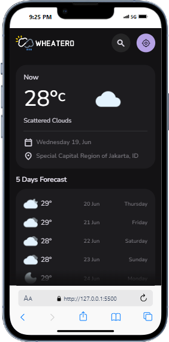
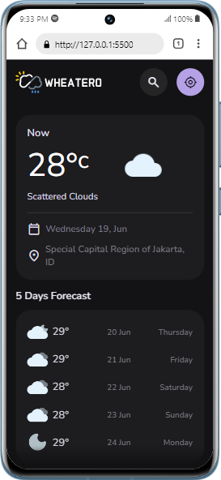
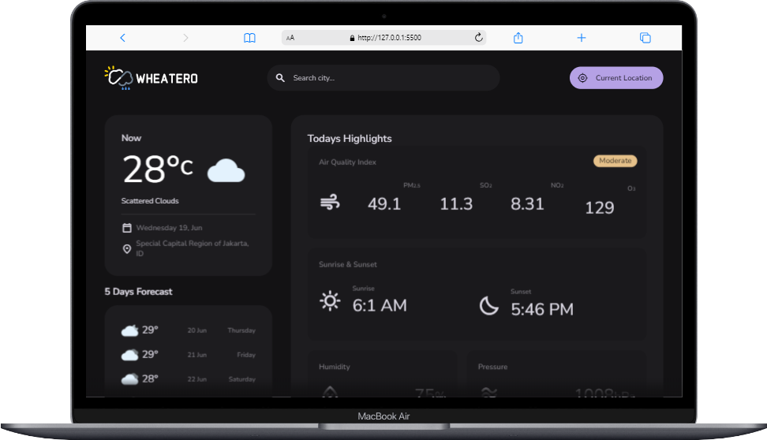

# Project Title

A brief description of what this project does and who it's for

## Tech Stack

**Client:** HTML, CSS, JavaScript, API

## Demo

Insert gif or link to demo

## Features

- Feature 1
- Feature 2
- Feature 3

## Screenshots





## Run Locally

Clone the project

```bash
  git clone https://link-to-project
```

Go to the project directory

```bash
  cd my-project
```

Open with VSCode

```bash
  code .
```

Open with live server

```bash
  npm run start
```
